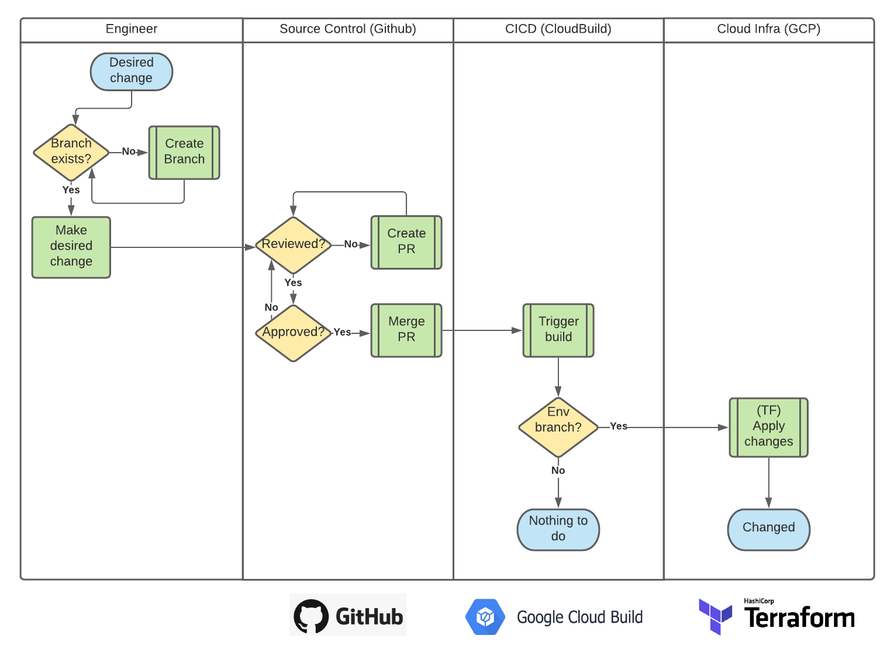
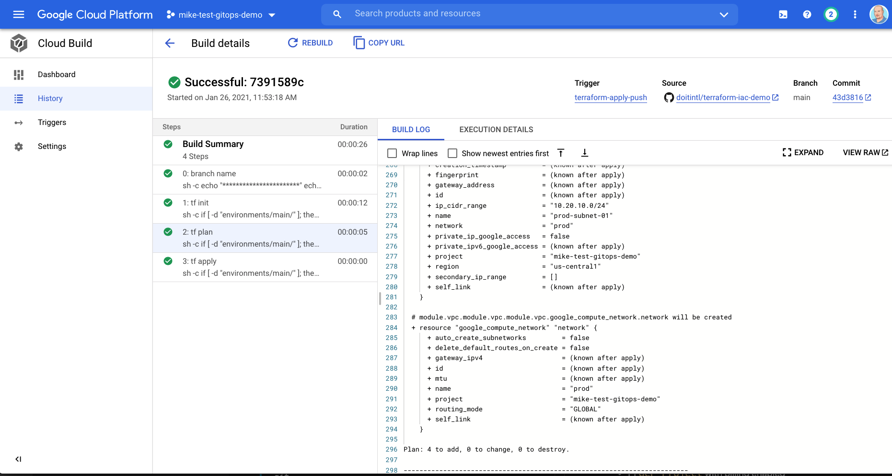

Change management has evolved given infrastructure is now API-driven. Traditionally [ITIL change management](https://wiki.en.it-processmaps.com/images/6/6b/Change-management-itil.jpg) required maintaining separate systems for compliance, but modern organizations leverage [GitOps](https://www.weave.works/technologies/gitops/) and [infrastructure as code (IaC)](https://www.hashicorp.com/resources/what-is-infrastructure-as-code) tools to automate and streamline processes as demonstrated in this repo.

# Modern Change Management
At [DoiT International](https://doit-intl.com) we advise cloud customers to implement modern change management using automated, self-documenting, processes as illustrated below.



# Prerequisites
Using this example assumes you have the following in place:
- [ ] `GCP Project` with billing enabled
- [ ] `Project Editor` or above (i.e. `Owner`) IAM role
- [ ] [Google Cloud SDK](https://cloud.google.com/sdk/docs/install)
- [ ] Knowledge of [Terraform](https://www.terraform.io/intro/index.html) and [GCP](https://cloud.google.com/gcp/getting-started)

# Install
```bash
# set config
gcloud config set project <project-id>

# clone repo (or fork it)
git clone git@github.com:doitintl/terraform-iac-demo.git
cd terraform-iac-demo

# reset git so you can push to your own repo
rm -rf .git
git init

# initialize project
./bin/setup.sh
```

# Configure
You will need to create a Git source code repository and connect it to Google Cloud Build as instructed below.
[Connect Github repository to Cloud Build](https://cloud.google.com/solutions/managing-infrastructure-as-code)

# Usage
Once you make sure you connect the repository for Cloud Build, and create a `push trigger`, you can then `commit`, `set your remote`, and `push` your code. This should trigger a build and Terraform tasks will run. See the document above (although dated and this repo is updated for later Terraform versions) for tips.



# Clean up
If you are just testing this functionality, to avoid incurring unnecessary cloud billing charges be sure to **delete your project** or follow these steps:

1. edit `main.tf` in `/prod` and `/dev` folder and remove modules
2. `commit` and `push` changes to trigger infrastructure changes
3. run the `./bin/teardown.sh` after resources removed

# Contributing
This repository is maintained by the staff at [DoiT International](https://doit-intl.com) 
